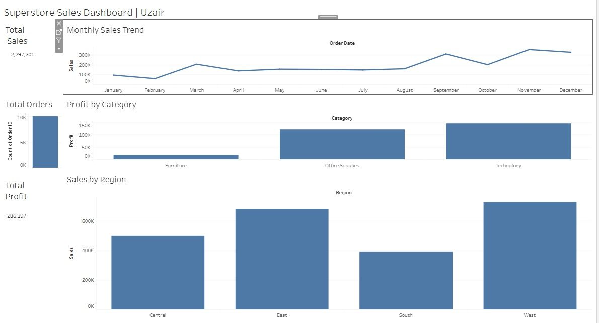

# 📈 End-to-End Business Intelligence & Sales Analytics System

### 🚀 Project Overview
**Role:** Data Analyst | **Domain:** E-commerce & Retail
**Tools:** Python (Pandas), SQL (Advanced), Tableau/Power BI

This project is an end-to-End Business Intelligence solution designed to analyze retail sales data, identify profit-draining products, and uncover high-potential growth regions. The goal was to transform raw sales data into actionable business insights for executive decision-making.

---

### 💼 Business Problem
The company faced visibility issues regarding:
1. **Profitability:** Which products are driving losses despite high sales volume?
2. **Regional Performance:** Which cities are underperforming?
3. **Customer Segmentation:** Who are the high-value customers?

### 🛠️ Tech Stack & Workflow
1. **Python (Data Engineering):**
   - Cleaned raw data, handled missing values, and removed duplicates.
   - Performed ETL (Extract, Transform, Load) to prepare data for SQL.
2. **SQL (Data Analysis):**
   - Utilized **CTEs**, **Window Functions**, and **Aggregations**.
   - Solved complex business queries regarding retention and sales trends.
3. **Tableau (Visualization):**
   - Designed an interactive Executive Dashboard with dynamic filtering.

---

### 📊 Key Insights (Derived from Data)
- **Loss Makers:** "Furniture" category has high sales but near-zero profit due to shipping costs.
- **Top Region:** The "West" region outperforms others by **32%** in profitability.
- **Seasonality:** Sales spike significantly in **November & December**, indicating a need for inventory stocking in Q3.

---

### 📷 Dashboard Preview

---

### 💻 How to Run This Project
1. Clone the repository.
2. Install dependencies: `pip install -r requirements.txt`
3. Run the cleaning script: `python data_cleaning.py`
4. Load the cleaned data into SQL Server and run `analysis_queries.sql`.
